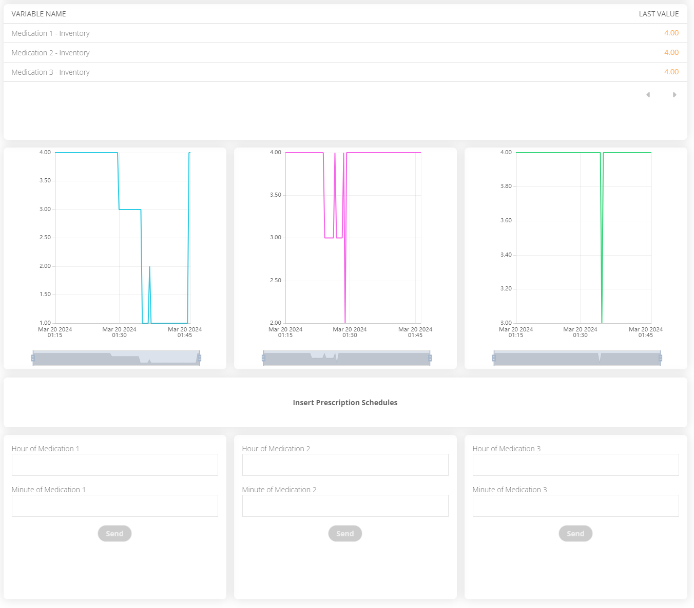
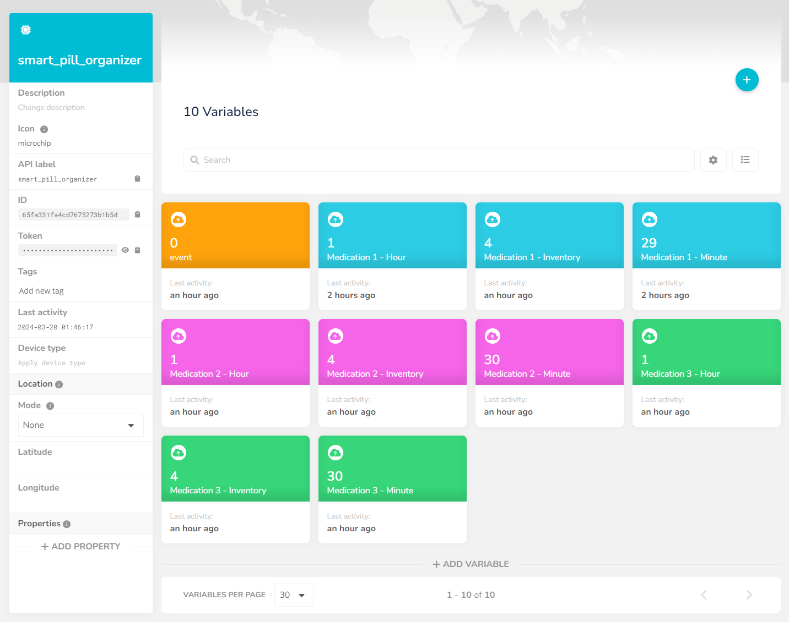

# Smart Pill Organizer

Our solution aims to alleviate the struggle of medication adherence by uniting a traditional pillbox with sensors and actuators. The smart pill organizer is able to detect the medication that is being taken and send the information to a cloud service. This information is then used to send reminders to the user and to keep track of the medication inventory.

## General Information

The major benefits of our solution are the automation of the medication intake process, the ability to keep track of the medication inventory and the possibility of sending email notifications to the user. This is a problem felt by many individuals all over the globe that often encounter challenges in adhering to their prescribed medication schedules, due to factors such as age, stress, memory loss, etc.
This struggle with medication adherence can lead to detrimental consequences, including ineffective treatments, deteriorating health conditions, and, in severe cases, death.

## Built With

### Hardware

* [Arduino Uno](https://store.arduino.cc/products/arduino-uno-rev3) - 1 unit - Development board for interacting with the Pixy2 Camera and to send data to the Ubidots STEM Cloud
* [Arduino Nano ESP32 with headers](https://store.arduino.cc/products/nano-esp32-with-headers) - 1 unit - Development board for interacting with Ubidots STEM Cloud and to interact with the Piezo Buzzer, LEDs and RGB Module
* [Pixy2 Camera](https://pixycam.com/pixy2/) - 1 unit - Vision sensor that can detect and track objects based on their color, used to detect the flunctuation of medication inventory.
* [Green LED Alert](https://www.exploringarduino.com/parts/green-led/) - 3 units - green light-emitting diode (LED) connected to the Arduino Nano ESP32 development board used to provide visual feedback to the user when it's time to take their medication.
* [RGB Module](https://arduinomodules.info/ky-016-rgb-full-color-led-module/) - 1 unit - Electronic component connected to the Arduino Nano ESP32 development board, used to provide visual feedback to the user when the Cloud Platform is offline.
* [Piezzo Buzzer](https://www.adafruit.com/product/160) - 1 unit - Electronic component connected to the Arduino Nano ESP32 development board, used to provide auditory feedback to the user when it's time to take their medication.
* [Resistor](https://en.wikipedia.org/wiki/Resistor) - 3 units - Electronic components used to limit the flow of electric current to the LED Alerts.
* [USB Cable](https://store.arduino.cc/products/usb-2-0-cable-type-a-b) - 1 unit - Connects the Arduino Uno development board to the computer that supplies its' power.
* [Micro-USB Cable](https://core-electronics.com.au/media/catalog/product/cache/d5cf359726a1656c2b36f3682d3bbc67/1/4/14678-pixy2_cmucam5-06.jpg) - 1 unit - Connects the Pixy2 Camera to the computer that supplies its' power.
* [USB-C Cable](https://store.arduino.cc/products/usb-cable2in1-type-c) - 1 unit - Connects the Arduino Nano ESP32 development board to the computer that supplies its' power.
* [Pixy IO to Arduino ISP Cable](https://cdn.sparkfun.com/r/345-345/assets/parts/1/2/8/8/0/14678-Pixy2_CMUcam5-05.jpg) - 1 unit - Connects the Pixy2 camera to the Arduino Uno development board so they can communicate.

### Software

* [Arduino Programming Language](https://www.arduino.cc/reference/en/) - Programming Language
* [Python](https://www.python.org/) - Programming Language
* [PixyMon](https://pixycam.com/downloads-pixy2/) - Software that enables parameterising the camera
* [Ubidots STEM](https://ubidots.com/stem) - Platform that provides tools and resources for IoT projects, used for Cloud Storage and Web Interface
* [Zapier](https://zapier.com/) - Web-based automation tool that can automate tasks that connect two or more apps together
* [Pixy2 Library](https://pixycam.com/downloads-pixy2/) - Software package that provides a set of functions and tools to interact with the Pixy2 Camera, making it easy to integrate in projects.
* [HttpClient Library](https://www.arduino.cc/reference/en/libraries/httpclient/) - Library to easily make HTTP GET, POST and PUT requests to a web server.
* [Ubidots API Documentation](https://docs.ubidots.com/reference/welcome) - Provides information and references for using the Ubidots API.

## Getting Started

These instructions will get you a copy of the project up and running on for testing purposes.  

### Assembly Instructions

#### Step 1. Arduino Nano ESP32 Assembly

Connect the components to the breadboard as shown in the following diagram:

 <figcaption>Image 1 - Arduino Nano ESP32, RGB Module, Piezzo Buzzer and LED Alerts assembly diagram.</figcaption>


Description:

1. Connect each Green LED to pins D3, D4, and D5 on the Arduino board using a 220-ohm resistor for each.  Attach one end of the resistor to the corresponding pin (D3, D4, or D5) using a wire and the other end to the positive (anode) leg of the LED using a jump wire. Connect the negative (cathode) leg of the LED to ground (GND) on the Arduino board using a jump wire.
2. Connect the RGB LED module to pin D2. Connect the pin labeled "R" on the LED to the pin D2 using a jump wire. Connect the Common (Cathode-) pin to ground (GND) on the Arduino board using a jump wire.
3. Connect the Piezzo Buzzer to pin D12. Connect the positive (anode) leg of the buzzer to the pin D12 using a jump wire and connect the negative (cathode) leg of the buzzer to the ground (GND) on the Arduino board using a jump wire.
4. Connect the Arduino Nano ESP32 to the computer using a USB-C cable to supply its' power.  

#### Step 2. Arduino Uno Assembly

1. Connect the Pixy2 to the the Arduino Uno using a Pixy IO to Arduino ISP Cable.
2. Connect Pixy2 to the computer using a Micro-USB cable to supply its' power. Use a USB 3.0 port to do so.
3. Connect the Arduino Uno to the computer using an USB cable to supply its' power.  

The end result should look similar to this:

<p float="left">
    
     
    
    <figcaption>Images 2-4 - Front, Side and Upward Perspective of the Pixy2 and Arduino Uno Assembly  </figcaption>
</p>  

### Software Prerequisites

The following libraries are required for our solution to work:


#### Python 3.11
Execute the following commands:
```console
pip install pyserial
pip install requests
```

#### Arduino Uno

* Install the board for the Arduino Uno by going to Tools ➜ Board ➜ Boards Manager... and once in the Boards Manager, search for Arduino AVR Boards by Arduino.
* Download the library for the Pixy2 camera [here](https://github.com/charmedlabs/pixy2/raw/master/releases/arduino/arduino_pixy2-1.0.3.zip) and in Arduino IDE install it by going to Sketch ➜ Include Library ➜ Add .ZIP Library… and choosing the downloaded file.

#### Arduino Nano ESP32

* Install the board for the Arduino Nano ESP32 by going to Tools ➜ Board ➜ Boards Manager... and once in the Boards Manager, search for Arduino ESP32 Boards by Arduino.
* Download the library HttpClient by going to Sketch ➜ Include Library ➜ Manage Libraries... and once in the Library Manager, search for HttpClient by Adrian McEwen.

#### Pixy2 Camera

* Download the companion software "PixyMon" [here](https://github.com/charmedlabs/pixy2/raw/master/releases/pixymon_windows/pixymon_v2_windows-3.0.24.exe).
* Install PixyMon following the [available guide](https://docs.pixycam.com/wiki/doku.php?id=wiki:v2:install_pixymon_on_windows_vista_7_8).

### Installation

Give step-by-step instructions on building and running the application on the testing environment.

Before running the system, make sure to comply to these prerequisites:

* All libraries and software were downloaded.
* In the file ```smart_pill_organizer/smart_pill_organizer.ino``` replace the WIFI_SSID and WIFI_PASSWORD fields with the credentials of your Wi-Fi network.
* In the file ```smart_pill_organizer/smart_pill_organizer.ino``` replace the gmtOffset_sec and daylightOffset_sec fields with the correct values of your local time.
* Ensure that in the file `post_request.py`, the COM port is correctly set to match the one your Arduino Uno is using.
* Ensure that in the file `get_request.py`, the COM port is correctly set to match the one your Arduino Nano ESP32 is using.
* Ensure that in the files `testing/ubidots_error_test.py` and `testing/ubidots_exception_test.py`, the COM port is correctly set to match the one your Arduino Nano ESP32 is using.

To get the system up and running please follow these steps:

1. Open PixyMon and teach Pixy2 the medication pills by following the [available guide](https://docs.pixycam.com/wiki/doku.php?id=wiki:v2:teach_pixy_an_object). The pills on the left compartment should have the signature 1, the pills on the middle compartment should have the signature 2 and the pills on the right compartment should have the signature 3. If more light is necessary for better capture go to Action ➜ Toggle Lamp.
2. Adjust the necessary parameters in File ➜ Configure ➜ Tuning and in File ➜ Configure ➜ Expert.
3. Open the file `camera_detection/camera_detection.ino` in Arduino IDE, select the Arduino Uno board and upload it.
4. Open the file `smart_pill_organizer/smart_pill_organizer.ino` in Arduino IDE, select the Arduino Nano ESP32 board, change the Wi-Fi credentials and upload it onto the board.
5. Close the Arduino IDE.
6. On the project's root, open a terminal and run the command ```python post_request.py```
7. On the project's root, open another terminal and run the command ```python get_request.py```
8. Let both scripts run.
9. You can now interact with the Smart Pill Organizer.


<p float="left">
    
     
    
    <figcaption>Images 5-7 - PixyMon Configurations and Action Menu.</figcaption>
</p>  

### Testing

Before starting, make sure all steps from the installation phase were done.

Add an email to receive notifications of the Smart Pill Organizer by accessing Zapier through this [guide](#zapier).

Start by signing into the Ubidots STEM account by following this [guide](#deployment).

####  Testing 1: Taking pills at the correct time
1. Go to Data ➜ Dashboards and check if the number of pills shown are correct.
2. Scroll down to Insert Prescription Schedules and insert the time to be tested in the Medication of your choice, for example 1 minute after the current time.
3. At the scheduled time, the buzzer will buzz and the corresponding LED of the medication chosen will light up green.
4. Check the email added to the receivers list in Zapier, there should be an received email with the following content: "Time to take a pill of medication #MedicationChosen".
5. In the pillbox, take out 1 pill of the medication chosen.
6. After one minute, the buzzer stops and the corresponding LED will be turned off.
7. Another email will be sent with the following content: "A pill of medication #MedicationChosen was taken at the correct time".

####  Testing 2: Taking pills at the incorrect time
1. In the pillbox, take out 1 pill of the medication chosen.
2. Check the email, there will be an email with the following content: "A pill of medication #MedicationChosen was taken at the incorrect time".

####  Testing 3: Not taking pills after 5 minutes of the scheduled time
1. Go back Data ➜ Dashboards.
2. Scroll down to Insert Prescription Schedules and insert the time to be tested in the Medication of your choice, for example 1 minute after the current time.
3. At the scheduled time, the buzzer will buzz and the corresponding LED of the medication chosen will light up green.
4. Check the email added to the receivers list in Zapier, there should be an received email with the following text: "Time to take a pill of medication #MedicationChosen".
5. Wait and after 5 minutes, the buzzer stops and the corresponding LED is turned off.
6. An email will be received with the following content: "Already passed 5 minutes since the scheduled time to consume medication #MedicationChosen - missed dosage".

####  Testing 4: Low inventory
1. In the pillbox, chose one of the medicines and take out the pills until there is left 1 or 0.
2. An email will be received with the content: "Please restock inventory of medication #MedicationChosen immediately, it only has #NumberOfPillsLeft pill.".
3. Until the medication is restocked, the same email will be sent every 10 minutes.

#### Testing 5: Simulate Ubidots being down (Error version)
1. Stop running the command ```python get_request.py```.
2. Run the command ```python testing/ubidots_error_test.py```.
3. The RGB LED will light up red until the command ```python get_request.py```is ran again.
4. Run the command ```python get_request.py``` and an email will be received with the following content: UPDATE: Cloud is back. It was down from #StartDowntimeDate to #EndDowntimeDate. You may receive some unexpected alerts.


#### Testing 6: Simulate Ubidots being down (Exception version)
1. Stop running the command ```python get_request.py```.
2. Run the command ```python testing/ubidots_exception_test.py```.
3. The RGB LED will light up red until the command ```python get_request.py```is ran again.
4. Run the command ```python get_request.py``` and an email will be received with the following content: UPDATE: Cloud is back. It was down from #StartDowntimeDate to #EndDowntimeDate. You may receive some unexpected alerts.

To check the content of the notifications before they are sent to the email go to Devices ➜ Devices ➜ smart_pill_organizer ➜ event.

The tests #1-4 are done to test the functionality of the system. The tests #5-6 are used to simulate cases in which Ubidots could be down.

## Demo

Our solution implements several features to enhance medication adherence. The following are the ones we would like to highlight:

- The system can identify up to three distinct types of medication and keep track of their quantities in the pill organizer.
- It can recognize up to four pills of each medication type.
- Even if the pills are too close to each other or some are in the wrong compartments, our system is able to correctly detect them.

<p float="left">
    
     
    
    <figcaption>Images 8-10 - Possible configurations of the medication detection system.</figcaption>
</p>
<br/><br/>

- The user can view their medication history (up to a month) and current inventory via the web interface.
- The web interface allows users to set their medication intake schedule.

 <figcaption>Image 11 - Dashboard of the web interface.</figcaption>

 <figcaption>Image 12 - Key features of the web interface: real-time inventory tracking, historical inventory data, and a prescription alarm setter.</figcaption>
<br/><br/>

- The system provides visual and auditory alerts using LEDs and a piezzo buzzer when it's time for the user to take a specific medication.
- Visual notifications are provided if the Cloud goes offline.

- The system sends email alerts to the user when it's time to take their medication.
- The user receives email confirmations when they take a dosage correctly.
- If a dosage is missed, the user is notified via email.
- The system sends email alerts if a pill is taken outside of the scheduled time.
- When the inventory of a specific medication drops to one or less, the user is notified via email.
- If the Cloud goes offline and then comes back online, the user is notified via email.  


<p float="left">
    
     
    
    
    
     
    <figcaption>Images 13-18 - Examples of all kinds of email notifications.</figcaption>
</p>

<br/><br/>

## Deployment

Our solution is developed for only one user as of now, therefore we did not establish a formal deployment process.
For the web interface, cloud storage, and email automation, we utilize services from Ubidots STEM and Zapier.
These platforms allow us to demonstrate the functionality of our project without a full-scale deployment.
To interact with those platforms, follow these steps:

### Ubidots STEM

To access the web interface and the data storage available on the Ubidots STEM platform, follow these steps:

1. Go [here](https://stem.ubidots.com/accounts/signin/) and log in with the following credentials:
    * Username: `smartpillorganizer_AmI05`
    * Password: `jfv9JhOWNgG9viyj4Blo`
2. Our web interface is located on Data ➜ Dashboards. In the dashboard you are able to see the current inventory, historical inventory data and insert medication's prescription time.
3. To check variables values go to Devices ➜ Devices ➜ Click on `smart_pill_organizer`. Select a variable and click on its widget.

 <figcaption>Image 19 - Interface of the device's variables.</figcaption>

 <figcaption>Image 20 - History of the variable "Medication 1 - Inventory"</figcaption>

More images of the Ubidots STEM platform are available on the [Demo](#demo) section.

### Zapier

To access the email automation "Zap", follow these steps:

1. Go [here](https://zapier.com/app/login) and log in with the following credentials:
    * Username: `smartpillbox.amia05@gmail.com`
    * Password: `EmpdGpzaal85NslXFGyb`
2. The zap that allows the automation of emails can be accessed through: Starting at Home ➜ Zaps ➜ Click on `Smart Pill Organizer Email Automation`. 
3. The zap can also be edited by clicking on the [link](https://zapier.com/editor/231593518/published).
4. If you wish to add your email to the receivers lists, on the zap (link above), click on `2. Send Email in Gmail` and add the desired email clicking on Step details ➜ Bcc.

 <figcaption>Image 21 - Zapier Dashboard.</figcaption>

 <figcaption>Image 22 - Zapier Email Automation.</figcaption>

## Additional Information

### Authors

* **Inês Ji** - [jiyiru](https://github.com/jiyiru)
* **Raquel Cardoso** - [raquelfmcardoso](https://github.com/raquelfmcardoso)
* **Jiqi Wang** - [JiqiWang](https://github.com/JiqiWang)

See also the list of [contributors](https://github.com/raquelfmcardoso/ambient-intelligence-2023-2024/contributors) who participated in this project.

### Versioning

We use [SemVer](http://semver.org/) for versioning.  
For the versions available, see the [tags on this repository](https://github.com/raquelfmcardoso/ambient-intelligence-2023-2024/tags).

### License

This project is licensed under the MIT License - see the [LICENSE.md](LICENSE.md) file for details.

### Contributing

Please read [CONTRIBUTING.md](https://gist.github.com/PurpleBooth/b24679402957c63ec426) for details on our code of conduct, and the process for submitting pull requests to us.

### Acknowledgments

* T. A. Prasath, B. Nani Gopala Krishna, S. A. Kumar, G. Karthick, G. Vishnuvarthanan, and S. Sakthivel, “A Smart Medicine Box for Medication Management Using IoT,” in 2021 3rd International Conference on Advances in Computing, Communication Control and Networking (ICAC3N), Dec. 2021, pp. 647–650.
* B. P. T. Rajan et al., “Smart Pill Box With Reminder To Consume And Auto-Filling Process Using IOT,” in 2021 Fifth International Conference on I-SMAC (IoT in Social, Mobile, Analytics and Cloud) (I-SMAC), Nov. 2021, pp. 40–44.